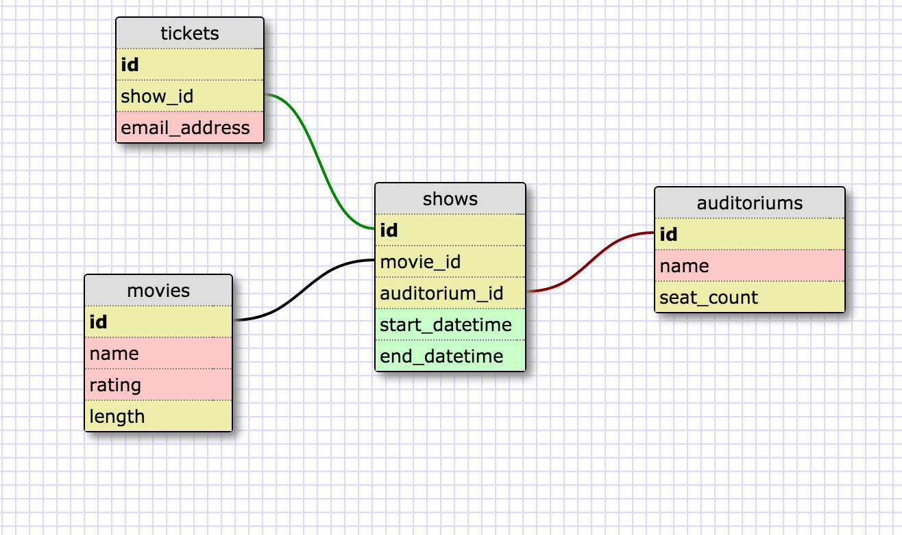

# Movie Theater

**A Rails app for a movie theater to handle ticket sales**

Plan:

1. Design schema for database
2. Setup mvc for users seeing movie listing
3. Setup mvc for ticket purchasing
4. Setup mailing system for receipt
3. Setup mvc for administrative
4. Style front-end for mobile first
5. Check testing
6. Expand seed data
7. Check user story

Schema

 

